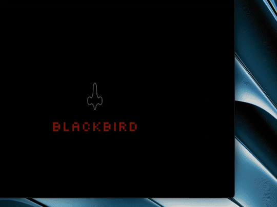

A multi-platform application for writing, organizing, and analyzing docs and data.



## About

Blackbird is a simple and elegant AI chat application that runs on desktop, web, and mobile. It provides a clean interface for interacting with local and remote AI models and managing your conversations.

## Features

*   **AI Chat:** A beautiful and intuitive chat interface for interacting with AI models.
*   **Saved Documents:** Save and manage your conversations and other documents.
*   **Theming:** Customize the look and feel of the application with light, dark, and octane themes.
*   **Multi-platform:** Runs on Windows, macOS, Linux, iOS, Android, and the web.

## Getting Started

To get started with Blackbird, you'll need to have Rust and the appropriate build tools for your target platform installed.

### Prerequisites

*   [Rust](https://www.rust-lang.org/tools/install)

### Building and Running

1.  **Clone the repository:**

    ```bash
    git clone https://github.com/joabar/blackbird.git
    cd blackbird
    ```

2.  **Create a `.env` file:**

    Copy the `.env.example` file to `.env` and add your AI provider's API key.

    ```bash
    cp .env.example .env
    ```

3.  **Build and run for your target platform:**

    *   **Desktop:**

        ```bash
        # Install the Dioxus CLI
        cargo install dioxus-cli

        # Run the desktop app
        dioxus serve --platform desktop
        ```

    *   **Web:**

        ```bash
        # Install the Dioxus CLI
        cargo install dioxus-cli

        # Run the web app
        dioxus serve --platform web
        ```

    *   **Mobile:**

        Follow the Dioxus documentation for setting up your mobile development environment: [Dioxus Mobile Docs](https://dioxuslabs.com/docs/0.5/guide/en/getting_started/mobile)

## Built With

*   [Rust](https://www.rust-lang.org/) - Join the [Community](https://www.rust-lang.org/community)
*   [Dioxus](https://dioxuslabs.com/) - Join the [Discord](https://discord.gg/XgGxMSkv3M) and check out [Awesome Dioxus](https://github.com/DioxusLabs/awesome-dioxus)
*   [Tokio](https://tokio.rs/) - Join the [Discord](https://discord.gg/tokio)
*   [Serde](https://serde.rs/) - Join the [Discord](https://discord.gg/serde)
*   [Reqwest](https://docs.rs/reqwest/latest/reqwest/) - Join the [Discord](https://discord.gg/rust-lang-community)
*   [Ollama](https://ollama.ai/) - Join the [Discord](https://discord.gg/ollama)

## Author

*   **Alessandro Joabar** - [@joabzzz](https://github.com/joabzzz)

## License

This project is licensed under the MIT License - see the [LICENSE.md](LICENSE.md) file for details.
