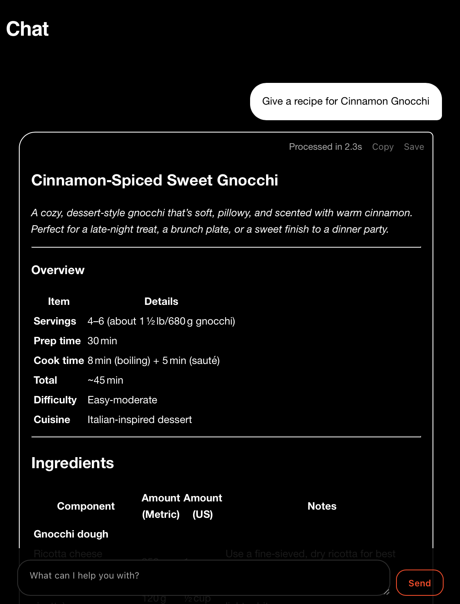
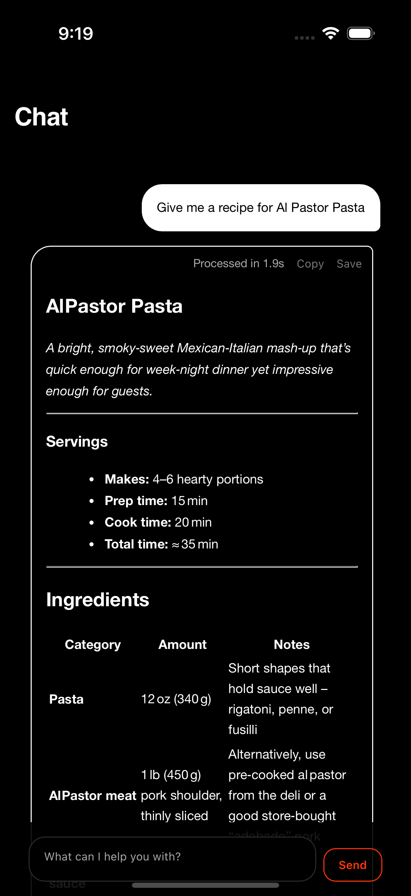

# Blackbird — Rust + Dioxus AI App Template

Build cross‑platform AI apps with one Rust codebase. This template uses Dioxus 0.6 (fullstack) to target desktop and web (mobile feature flags are wired in and ready to extend).

It includes a chat UI with streaming responses, Markdown rendering with syntax highlighting, and pluggable LLM backends configured via environment variables.

## Highlights

- Cross‑platform targets: desktop and web, with mobile ready via features
- Streaming support: Server‑Sent Events (SSE) and JSONL styles
- Pluggable LLMs: custom HTTP endpoint, local Ollama, or hosted Blackbird
- Safe secrets: `.env` is loaded only on the server/desktop side
- Clean UI: Markdown + code highlighting, copy/save actions, performance timing

### Desktop & iOS

<table>
  <tr>
    <td></td>
    <td></td>
  </tr>
  <tr>
    <td align="center"><sub>Desktop</sub></td>
    <td align="center"><sub>iOS</sub></td>
  </tr>
</table>


---

## Quickstart

1) Prerequisites

- Rust toolchain: https://rustup.rs
- Dioxus CLI: `cargo install dioxus-cli` (binary name: `dx`)
- For web builds: `rustup target add wasm32-unknown-unknown`
- Optional: Ollama running locally (if you want local LLMs)

2) Configure an LLM backend

- Copy `.env.example` to `.env` and set one of the options below.
- Only one is needed; the app chooses in this order: `LLM_ENDPOINT` → `LLM_USE_OLLAMA` → `BLACKBIRD_ENDPOINT`.

Options in `.env`:

```bash
# Option 1: Custom non‑streaming endpoint
# Expects:  { messages: [{role, content}, ...] }
# Returns:  either { content } JSON or plain text
LLM_ENDPOINT="https://your.internal.endpoint/chat"

# Option 2: Local Ollama (non/streaming)
LLM_USE_OLLAMA=true
LLM_MODEL="gpt-oss:20b"   # optional
```

3) Run in development

- Desktop (recommended for local dev):

```
dx serve --platform desktop
```

- Web (runs a dev server and browser preview):

```
dx serve --platform web
```

Note: In web mode, Dioxus server functions run on the dev server, so `.env` variables remain server‑side.

4) Build for release

- Desktop binary:

```
dx build --release --platform desktop
```

- Web assets (static site in `dist/`):

```
dx build --release --platform web
```

If you prefer Cargo directly for desktop, disable the default features and enable `desktop`:

```
cargo run --no-default-features --features desktop
```

---

## LLM Backends

This template supports three backend modes selected by env vars, in priority order:

1) Custom HTTP endpoint (`LLM_ENDPOINT`)

- Request body:

```json
{ "messages": [{ "role": "user" | "assistant", "content": "..." }] }
```

- Response: ideally `{ "content": "..." }` JSON. If the response is plain text, it will be displayed as‑is.
- Streaming: not required — the app will poll once and render the full reply.

2) Local Ollama (`LLM_USE_OLLAMA=true`)

- Endpoint: `http://127.0.0.1:11434/api/chat`
- Non‑streaming and streaming are supported. Set `LLM_MODEL` to select a model.

3) Blackbird (`BLACKBIRD_ENDPOINT` + optional `BLACKBIRD_*`)

- Non‑streaming and streaming via SSE are supported.
- Accepts OpenAI‑like response shapes (choices[].delta/content) or `{ content }`.
- Uses `Authorization: Bearer <BLACKBIRD_API_KEY>` if provided.

Security note: never commit real keys. Use `.env` locally and your platform’s secret manager for production.

---

## Project Structure

- `src/ui.rs` — Dioxus components and chat UI (Markdown, syntax highlight, copy/save, streaming)
- `src/ai.rs` — Server functions and backend integrations (custom, Ollama, Blackbird; SSE/JSONL parsing)
- `src/types.rs` — Shared types (`Role`, `ChatMessage`)
- `src/main.rs` — Entry point; loads `.env` on non‑WASM targets and launches the app
- `assets/mostra.css` — Minimal design tokens and components
- `Dioxus.toml` — Platform configuration for the `dx` CLI
- `.env.example` — Example runtime configuration for LLM backends

Features in `Cargo.toml`:

- `web` → `dioxus/web`
- `desktop` → `dioxus/desktop`
- `mobile` → `dioxus/mobile` (enabled by default; use the `dx` CLI or set features explicitly when using Cargo)

---

## UI Details

- Markdown rendering with code blocks, tables, lists, strikethrough, and task lists
- Syntax highlighting via `syntect`
- Streaming indicator with a shimmer effect while waiting
- Copy to clipboard on assistant messages (desktop/mobile)
- Inline processing time display: “Processed in X.Ys”

---

## Customizing

- Styling: edit `assets/mostra.css` for colors, spacing, and components.
- Chat behavior: tweak `src/ui.rs` to adjust message rendering, input behavior, and controls.
- Providers: extend `src/ai.rs` to add new LLMs or change routing/shape handling.

---

## Testing & Troubleshooting

- Run tests:

```
cargo test
```

- Common issues:

- “No LLM configured”: ensure `.env` sets one of `LLM_ENDPOINT`, `LLM_USE_OLLAMA=true`, or `BLACKBIRD_ENDPOINT`.
- CORS in web mode: when pointing at remote APIs, prefer using the bundled server function as a proxy so secrets stay server‑side.
- Feature flags: if using `cargo run`, pass `--no-default-features --features desktop` for desktop.

---

## Production Notes

- Keep API keys server‑side. In desktop builds, keys live in the local process. In web builds, use a backend proxy for API calls — don’t expose keys to the browser.
- Consider rate‑limit, retries, and content filtering for user‑facing releases.
- Bundle and sign platform binaries per your distribution needs.

---

## License

This template is provided as‑is for you to adapt.
