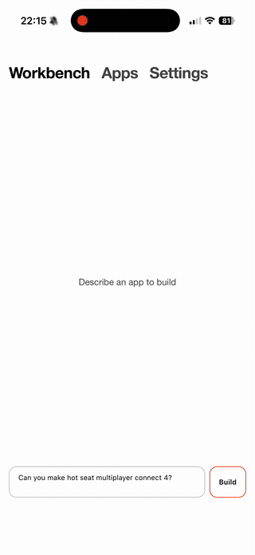

<div align="center">


### Build The App You Need When You Need It



[](https://www.rust-lang.org/)
[](https://dioxuslabs.com/)
[](LICENSE)
[]()

**Build interactive apps with natural language. No coding required.**

[Getting Started](#getting-started) • [Features](#features) • [Architecture](ARCHITECTURE.md) • [Contributing](#contributing)

</div>

---

## What is Blackbird?

Blackbird is a cross-platform AI application that lets you **create fully functional interactive apps just by describing them**. Simply tell Blackbird what you want to build—a calculator, a todo list, a game, a data visualization—and watch as it generates a complete working application in real-time.

Built with Rust and the Dioxus framework, Blackbird runs natively on iOS, desktop, and web, delivering a fast and seamless experience across all your devices.

---

## Features

### 🛠️ **AI Workbench**
The heart of Blackbird. Describe any app you can imagine and watch it come to life:
- **Real-time streaming** — See your app being built character by character
- **Live preview** — Interact with your creation instantly as it generates
- **Intelligent extraction** — Auto-generates titles and tags from your apps
- **Conversation history** — Refine and iterate on your creations

### 📱 **Apps Gallery**
Your personal collection of AI-generated applications:
- **Persistent storage** — Apps are saved locally and available offline
- **Full-screen mode** — Launch apps in an immersive, distraction-free view
- **Smart organization** — Sort by date or name, filter by tags
- **Quick management** — Delete apps you no longer need

### 🎨 **Theming**
Make Blackbird yours:
- **Dark Mode** — Easy on the eyes
- **Light Mode** — Clean and bright
- **Octane** — Vibrant orange for those who like to stand out

### 🔧 **Blackbird SDK**
Every generated app has access to powerful built-in APIs:
```javascript
// Persistent storage that survives app restarts
await blackbird.storage.set('highScore', 9001);
const score = await blackbird.storage.get('highScore');

// Each app gets its own isolated storage namespace
await blackbird.storage.keys(); // List all saved data
```

---

## Getting Started

### Prerequisites

- [Rust](https://rustup.rs/) (2024 Edition)
- [Dioxus CLI](https://dioxuslabs.com/learn/0.6/getting_started): `cargo install dioxus-cli`
- An API key from one of the supported providers

### Installation

```bash
# Clone the repository
git clone https://github.com/yourusername/blackbird.git
cd blackbird

# Copy the environment template
cp .env.example .env

# Add your API key to .env
# OPENAI_API_KEY=sk-...
# or ANTHROPIC_API_KEY=...
# or BLACKBIRD_API_KEY=...
```

### Running Blackbird

```bash
# Desktop
dx serve --platform desktop

# Web
dx serve --platform web

# iOS (requires Xcode)
dx serve --platform ios
```

### Building for Production

```bash
# Desktop release build
dx build --release --platform desktop

# iOS release (see docs/IOS_DEPLOYMENT.md for full guide)
dx bundle --platform ios
```

---

## Supported AI Providers

Blackbird intelligently detects which provider to use based on available API keys:

| Provider | Model | Environment Variable |
|----------|-------|---------------------|
| **Blackbird** (default) | Custom | `BLACKBIRD_API_KEY` |
| **OpenAI** | GPT-4o | `OPENAI_API_KEY` |
| **Anthropic** | Claude 3.5 Sonnet | `ANTHROPIC_API_KEY` |
| **Ollama** | LLaMA (local) | `OLLAMA_HOST` |

---

## Project Structure

```
blackbird/
├── src/
│   ├── ai/           # AI client and provider integrations
│   ├── views/        # UI views (Workbench, Apps, Settings)
│   ├── tools/        # AI function calling tools
│   ├── bridge.rs     # Blackbird SDK injection
│   ├── theme.rs      # Theming system
│   └── ui.rs         # Main app component
├── assets/           # Bundled assets and styles
├── ios/              # iOS Xcode project
└── docs/             # Documentation and media
```

For a deep dive into the architecture, see [ARCHITECTURE.md](ARCHITECTURE.md).

---


## Contributing

Contributions are welcome! Please feel free to submit a Pull Request.

1. Fork the repository
2. Create your feature branch (`git checkout -b feature/amazing-feature`)
3. Commit your changes (`git commit -m 'Add amazing feature'`)
4. Push to the branch (`git push origin feature/amazing-feature`)
5. Open a Pull Request

---

## License

This project is licensed under the MIT License - see the [LICENSE](LICENSE) file for details.
